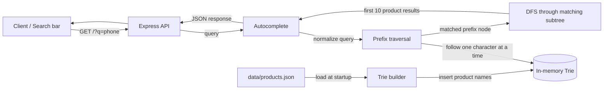
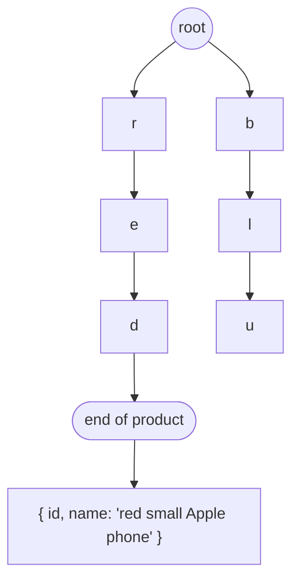

# Autocomplete Search Bar


## 🛠️ Requirements

Imagine you have a website with a search bar. As the user types, the API should return autocomplete results for their query.

Return a list of objects with `id` and `name`:

```json
{
  "id": 1,
  "name": "red small Apple phone"
}
```

## 👩🏻‍💻 Implementation

### Architecture



At startup, the application reads `data/products.json` and inserts every product name into an in-memory Trie. Each character becomes a node, and products with the same beginning share those nodes. For example, products starting with `phone` use the same path from the root through `p`, `h`, `o`, `n`, and `e`.

When a request arrives, the query is converted to lowercase and the Trie is traversed one character at a time. If the whole prefix exists, the final node represents every product that begins with that prefix. A depth-first search (DFS) then starts at that node, visits its descendants, and collects the products stored at terminal nodes. The response returns the first 10 collected products; a blank query or missing prefix returns an empty array.

### Index structure



Each node stores a map of child characters. Shared prefixes reuse the same nodes, so products that start alike share their initial path. Product names and query text are normalized to lowercase, making matching case-insensitive while responses keep the original name.


### Complexity

For a query with $p$ characters, finding its Trie node takes $O(p)$. Gathering results visits nodes below that prefix; the returned response is capped at 10 products, although the current depth-first traversal may inspect additional matching nodes before applying the limit. The index is constructed once at startup, with insertion cost proportional to the total number of characters across all product names.

## ⚙️ How To Run

1. Install dependencies and generate product data:

```bash
npm install
node_modules/.bin/ts-node src/data_generator.ts 1000000 # generate 1M products
```

2. Run the project and query it:

```bash
npm run dev
curl 'localhost:3001?q=phone'
```
