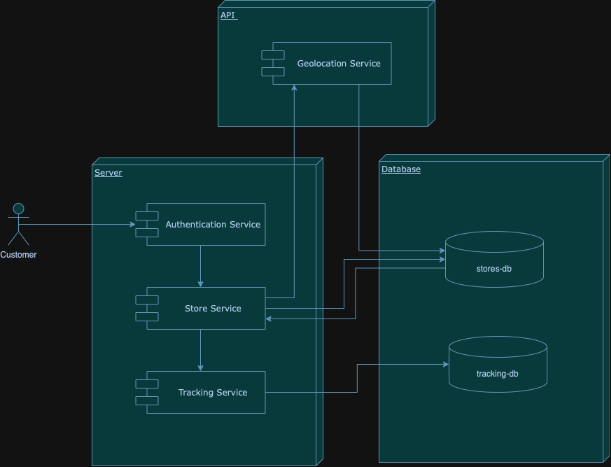
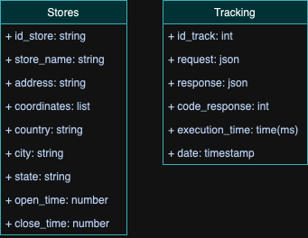
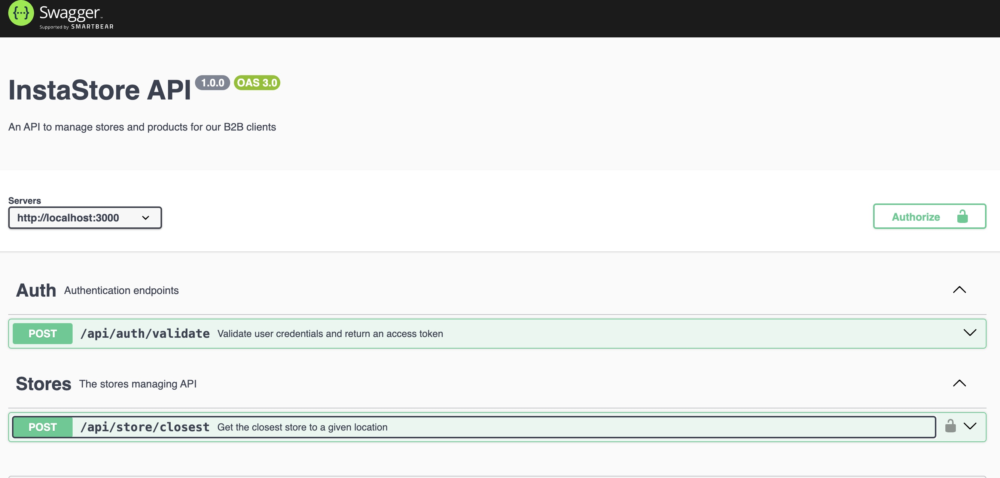

# InstaStore


Challenge Backend Engineer for Instaleap

## 🛠️ Requirements
InstaStore is a microservice in charge of selecting the closest "convenience" store to deliver a groceries order to our B2B clients.

    Non-functional:
    - We expect you to deliver idiomatic code in a way that is easy to read and follows the accepted guidelines in your area of expertise.
    - You should write it on Node.js with Express.js. Libraries, transpilers, etc are up to you.
    - Endpoints are fast (less than 300ms).
    - Endpoints respond to error codes that make sense to the case.
    - Please provide documentation for the endpoints you create

    Functional:
    Our B2B clients should be able to consume an endpoint that provides them the following information:
    - storeId
    - storeName
    - isOpen
    - coordinates
    - nextDeliveryTime
    The endpoint returns the closest store available
    We need to keep track of each call to the endpoint

<br>

## ❓ Questions and Answers

1. What is the input that the endpoint receives to bring the nearest store?

    - expected_delivery: utcDate , which represents the estimated time of delivery of an order in utc time.
    - It also has the destination information (where the order is expected to be delivered).
        {
                "name": "string",
                "address": "string",
                "address_two": "string",
                "description": "string",
                "country": "string",
                "city": "string",
                "state": "string",
                "zip_code": "string",
                "latitude": number,
                "longitude": number
        }

2. How should we deal with the case that there are several stores with the same distance?

    This may be highly unlikely, but in such a case, we can choose any store.

3. How is the nextDeliveryTime calculated?

    Propose how it should be calculated according to the data you have, but basically it represents the next available time the store can deliver an order.

4. Should we implement some kind of authentication for the customers consuming the service?

    It is not mandatory but it would be great if you do it

5. Should I use any API or specific information to obtain the coordinates of the stores?

    You can take as a base the Soriana stores in Monterrey and Mexico City. You can put together the structure that you think is convenient for you.

6. What kind of data should be stored to track each call to the endpoint?

    For this you can think of things that can be useful assuming you are in a production environment. For example the execution time of the endpoint, what the endpoint returns, at what time the call was made, etc.
    The idea of this is that we can be monitoring through an external tool how the service is behaving.

<br>

## 🚛 Delivery of the final product
Thursday, April 4, 2024

<br>

## 👩🏻‍💻 Implementation

### Architecture

<div align="center">
  <div class="image-container">
        
    </div>
</div>

<br>

1. Customer authentication: The customer logs into the InstaStore system using authentication credentials.
2. Obtaining store coordinates: When the customer makes a request to find the nearest store, the InstaStore service queries an external geolocation service to obtain the coordinates of all available stores. These coordinates are stored in the stores database for further use.
3. Finding the nearest store: Once the store coordinates have been stored in the stores database, the store service queries this database to find the store closest to the customer's location. This is done using distance calculation algorithms.
4. Delivery of information to the customer: Once the nearest store is found, the store service returns the store information (storeId, storeName, isOpen, coordinates, nextDeliveryTime) to the client in JSON format.
5. Storage in the tracking service: Simultaneously, the request and response of the customer's request are recorded in a tracking service (middleware), which stores this information for further analysis and tracking. This includes details such as the IP address of the customer, the timestamp of the request, the information of the selected store, among others.

### Data modeling

<div align="center">
  <div class="image-container">
        
    </div>
</div>

<br>

For this implementation, it was decided to use a non-relational database model, since the information we are interested in at this moment, such as the stores and the tracking of the calls, is not strictly related. Therefore, for simplicity reasons we decided to use the mongodb engine, for its easy coupling and support with Express.

### Observations
- For the endpoint that brings the nearest store, initially it was thought to use a GET method since it is about obtaining information, but since it is using the Swagger tool to document, it is not allowed to send a body to the GET, therefore it ended up being called a POST method

- For my criteria to select the nearest store, I have taken into account if the store is open (I have taken into account the open ones since a user when shopping will be interested in the nearest one, but also if it is available in service, in the event that there is no open one, the closest closed one will be given), and finally by means of the longitude-latitude and time I calculate the nearest one.

- In the tracking model I thought it would be interesting to add a field for the code_response, in case we want to filter by failed requests and easily identify an error in the system.

- I decided to implement tracking as a middleware, since we need to save the information of all the requests, this way I can run it at the start of the endpoint and save when the execution finishes and get all the data I need

- I added a field called origin in the input, this to specify which is the store of which I want to know its headquarters closest to my address, this way I can know the information of different stores.

### Documentation
The api documentation can be found at
```
http://localhost:3000/
```

<div align="center">
  <div class="image-container">
        
    </div>
</div>

<br>


### Demostration
In this video you can find the operation of the feature: [Functionality🎥](https://youtu.be/9i-dOdu2Y3g)

## 🤓 Improvements and trade offs
1. What would you improve from your code? why?

    I would make it a bit more modular, in this case for simplicity and time issues I didn't do it since I didn't need to reuse logic, but in the future for a more scalable application I would ideally divide it into more reusable modules.

2. Which trade offs would you make to accomplish this on time? What'd you do next time to deliver more and sacrifice less?

    Focus on what is really important, this time I wasted a lot of time trying to understand the creation of the stores and their structure, which although relevant to the challenge, was not the key question, you can have implicitly the creation of the stores and thus move forward with the business logic we need.


3. Do you think your service is secure? why?

    Yes, although the exposed information is not sensitive data since it returns information from "public" addresses, authentication with JWT was implemented to protect user information and securely access our api, for this exercise we are simply generating the tokens to authenticate, but in a production application the idea would be to be able to use this functionality in a login, for a logged-in user to have access to our application
    
4. What would you do to measure the behavior of your product in a production environment?

    Use monitoring tools like Grafana, here I can see all the logs with the requests, responses, execution times, errors and more details that are useful to improve the product, I would also set up a notification system that allows me to know the status of the application, if there is a critical error or if it is not working.

<br>

## ⚙️ How To Run

- Clone the repository
```
git clone https://github.com/Valentina17varela/InstaStore.git
```

- Create an .env file following the structure of example.env

- Install dependencies
```
npm install
```

- Configure the environment variables, create an .env file with the variables from example.env

- Run the application
```
npm run start
```

- To start the server go to the following address  
```
http://localhost:3000/
```