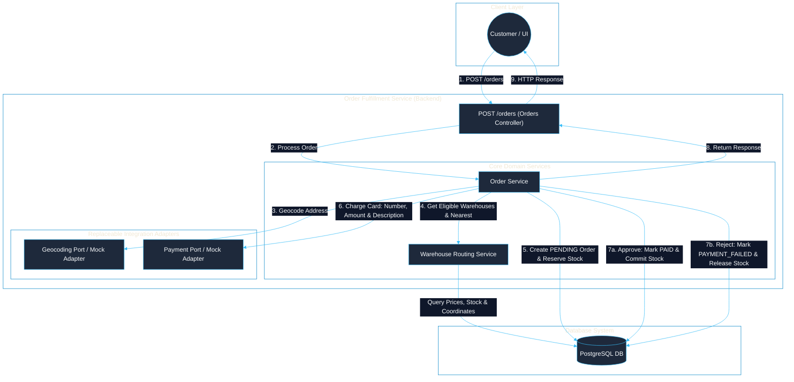

# Order Fulfillment Service


Backend Engineer Technical Challenge

## 🛠️ Requirements

Backend service for an e-commerce platform, web server with a minimal order management API

- POST /orders to create an order, which will be called by the UI as customers place orders.
- Orders have a customer, a shipping address, and a list of items (products and quantities).
- An order must be filled from a single warehouse, so you need to find a warehouse that has all the requested products. If multiple warehouses fit, you should pick the one closest to the shipping address.
- For converting an address to latitude/longitude, usually we’d use a 3rd party geocoding api. You can mock that.
- On creating the order, it should call an external payment API, which you can mock. The payments API takes as input a credit card number, amount, and description (we know in the real world we wouldn’t want to have people’s credit card numbers and the payment integration would be more complicated than a simple API request, but let’s imagine that it’s that simple).

### Meta-instructions

- You may use the language/framework of your choice.
- There is no need to implement a full application or APIs for managing customers, warehouses, or products. Authentication is also outside the scope; only the functionality specified above is required.
- The required functionality should be production-ready. Use a real database and treat data storage and management with the rigor expected from a high-traffic production system.

<br>

## 👩🏻‍💻 Implementation

### Architecture

<div align="center" style="max-width: 700px; margin: 0 auto;">



</div>

1. **Order request:** The Orders Controller validates `POST /orders` and delegates the process to the Order Service. Authentication and management APIs for customers, warehouses, and products are intentionally outside the challenge scope.

2. **Geocoding:** A mock adapter converts the shipping address into coordinates. Warehouse coordinates are stored in PostgreSQL, and the adapter implements a port that can later connect to a real provider.

3. **Warehouse selection:** Only warehouses with all requested products and quantities are considered. If several qualify, the nearest one is selected using the Haversine formula; otherwise, the API returns a conflict response.

4. **Total and payment:** The backend calculates the total using database prices and sends the card number, amount, and description to the mock payment adapter. Credit card data is never persisted or logged.

5. **Persistence:** Before payment, a transaction creates a `PENDING` order and reserves stock. Approval atomically marks it as `PAID` and commits the stock deduction; rejection marks it as `PAYMENT_FAILED` and releases the reservation.

6. **Response and observability:** The API returns `201 Created` with the order details or an appropriate error status. Logs include execution and integration data while excluding sensitive information; persistent tracking can be added later.

### Data modeling

<div align="center" style="max-width: 650px; margin: 0 auto;">


</div>

For this implementation, **PostgreSQL** was selected because customers, orders, products, warehouses, and inventory are strongly related and require transactional consistency. Each local state transition is atomic, while payment failures are handled by a compensating transaction that releases reserved stock.

- `warehouse_inventory` models the many-to-many relationship between warehouses and products. Availability is calculated as `quantity - reserved_quantity`, preventing concurrent orders from using the same stock.
- `order_items` preserves the purchased quantity and unit price at the time of the order.
- The shipping address and coordinates are stored in `orders` as a snapshot, so historical orders are not affected by later customer address changes.
- Monetary columns use a fixed decimal precision, statuses use a database enum or `CHECK`, and foreign keys are indexed. Quantities and amounts are protected by the constraints shown in the diagram.
- The nullable payment transaction identifier is stored for traceability after approval, but credit card numbers are never persisted or included in logs.

<br>

## ⚙️ How To Run

Prerequisites: Node.js and a Docker-compatible runtime.

```bash
npm install
cp example.env .env
# Replace every placeholder in .env with local values
npm run start:dev
```

`start:dev` performs the complete local setup:

1. Starts PostgreSQL and waits until it is healthy.
2. Applies pending migrations.
3. Inserts missing initial data without replacing existing records.
4. Starts the NestJS API in watch mode.

The PostgreSQL data is stored in a Docker volume and remains available between restarts.

```bash
npm run db:stop    # Stop PostgreSQL and preserve its data
npm run db:remove  # Remove PostgreSQL and all local database data
```

- API: `http://localhost:3000`
- Swagger: `http://localhost:3000/docs`
