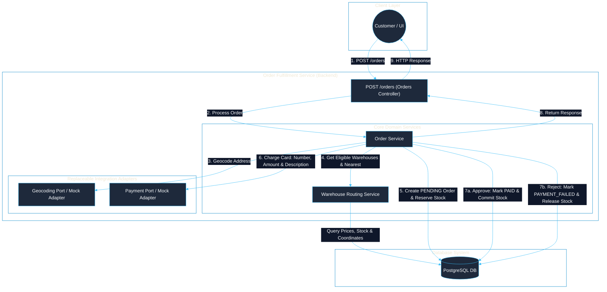
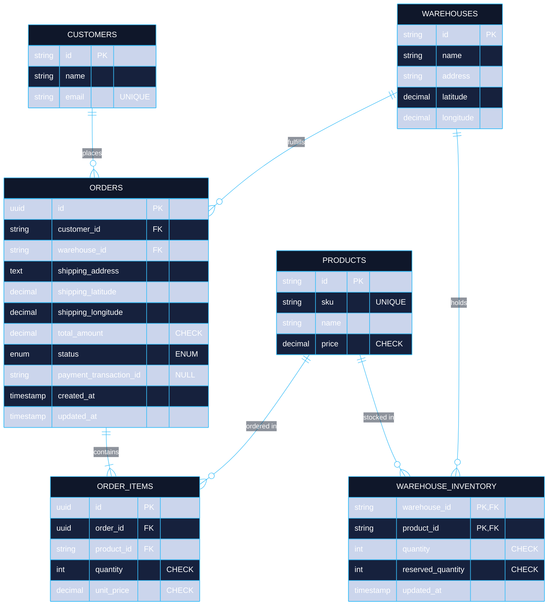

# Order Fulfillment Service


Backend Engineer Technical Challenge

[🎥 Demo: Order Fulfillment: Inventory, Payments & Concurrency Demo](https://youtu.be/9i-dOdu2Y3g)

## 🛠️ Requirements

Backend service for an e-commerce platform, web server with a minimal order management API

- POST /orders to create an order, which will be called by the UI as customers place orders.
- Orders have a customer, a shipping address, and a list of items (products and quantities).
- An order must be filled from a single warehouse, so you need to find a warehouse that has all the requested products. If multiple warehouses fit, you should pick the one closest to the shipping address.
- For converting an address to latitude/longitude, usually we’d use a 3rd party geocoding api. You can mock that.
- On creating the order, it should call an external payment API, which you can mock. The payments API takes as input a credit card number, amount, and description (we know in the real world we wouldn’t want to have people’s credit card numbers and the payment integration would be more complicated than a simple API request, but let’s imagine that it’s that simple).

<br>

## 👩🏻‍💻 Implementation

### Architecture

<div align="center" style="max-width: 700px; margin: 0 auto;">



</div>

1. **Order request:** The Orders Controller validates `POST /orders` and delegates the process to the Order Service. Authentication and management APIs for customers, warehouses, and products are intentionally outside the challenge scope.

2. **Geocoding:** A mock adapter converts the shipping address into coordinates. Dallas `TX 75202`, Austin `TX 78701`, and Houston `TX 77002` use an explicit coordinate catalog so manual warehouse-selection results are realistic and repeatable. Other addresses use a deterministic hash fallback that always returns the same synthetic coordinate within the contiguous United States. Fallback coordinates are not a real geographic lookup and exist only to keep the mock usable with arbitrary addresses. The adapter implements a port that can later be replaced by a real provider without changing the order use case.

3. **Warehouse selection:** Duplicate products are consolidated before checking stock. Only warehouses where every product satisfies `quantity - reserved_quantity >= requested quantity` are eligible. If several qualify, the nearest one is selected using the Haversine formula, with warehouse ID as a deterministic tie-breaker. If none qualifies, the API returns `409 Conflict`.

4. **Total and payment:** The backend calculates the total using database prices and sends the card number, amount, and description to the mock payment adapter. Credit card data is never persisted or logged. The mock approves valid cards by default; `4000000000000002` simulates a rejection, `4000000000000119` simulates an unexpected provider error, and `4000000000000259` simulates a timeout.

5. **Persistence:** Before payment, a transaction creates a `PENDING` order and reserves stock. Approval atomically marks it as `PAID` and commits the stock deduction; rejection marks it as `PAYMENT_FAILED` and releases the reservation.

6. **Response:** The API returns `201 Created` with the order, warehouse, items, total, and nullable payment transaction ID. Invalid requests return `400`, unavailable inventory returns `409`, and payment provider failures return `502` after compensation.

### Data modeling

<div align="center" style="width: 80%; max-width: 500px; margin: 0 auto;">



</div>

For this implementation, **PostgreSQL** was selected because customers, orders, products, warehouses, and inventory are strongly related and require transactional consistency. Each local state transition is atomic, while payment failures are handled by a compensating transaction that releases reserved stock.

Customer, product, and warehouse IDs use short strings such as `customer-1`, `product-1`, and `warehouse-1` to make the demonstration requests easier to read and run manually. In a production system, these identifiers would normally be generated UUIDs, as order and order-item IDs already are.

- `warehouse_inventory` models the many-to-many relationship between warehouses and products. `quantity` is the physical stock and `reserved_quantity` is stock temporarily assigned to orders whose payment is still pending. Availability is `quantity - reserved_quantity`, which prevents two concurrent orders from selling the same units.
- `reserved_quantity` is constrained between zero and `quantity`. On payment approval, reserved units are removed from physical stock; on rejection, the reservation is released without changing `quantity`.
- `order_items` preserves the purchased quantity and unit price at the time of the order. This prevents historical totals from changing when a product price is updated later.
- The shipping address and coordinates are stored in `orders` as a snapshot, so historical orders are not affected by later address or geocoding changes.
- `PENDING`, `PAID`, and `PAYMENT_FAILED` represent the payment lifecycle and make incomplete or compensated operations visible instead of deleting their history.
- Monetary columns use fixed decimal precision instead of floating-point values, avoiding binary rounding errors. Foreign keys and inventory lookup columns are indexed for order and availability queries.
- `payment_transaction_id` is nullable because it does not exist before payment approval, and unique so the same provider transaction cannot be assigned to multiple orders.
- Credit card numbers are accepted only by the request DTO and passed to the payment adapter. They are never persisted or returned.

### Observations

- Repeated products in the request are consolidated before warehouse selection and persistence. This avoids treating duplicate lines as independent stock requirements and stores one `order_items` row per product.
- Warehouse availability is checked twice: first to select a candidate and again inside the reservation transaction while inventory rows are locked. This prevents concurrent orders from overselling the same stock.
- Payment is intentionally executed outside the database transaction. The order is first persisted as `PENDING` with reserved inventory, then a second transaction either commits the physical stock deduction or compensates the reservation.
- A declined payment returns a persisted `PAYMENT_FAILED` order with `201 Created`, because the order resource was created and its final payment state is part of the response. Provider errors and timeouts return `502 Bad Gateway` after compensation.
- Geocoding and payment integrations are defined through application ports. The included adapters are deterministic mocks that can be replaced by real providers without changing the order orchestration.
- Initial products, warehouses, inventory, and the sample customer are loaded from a validated JSON file. This keeps the challenge reproducible and the seed idempotent without exposing management endpoints outside the requested scope.
- Authentication, customer/product/warehouse CRUD APIs, and idempotency keys are outside the stated scope. An idempotency key would be a recommended addition before exposing `POST /orders` to retrying production clients.

### Improvements

The current implementation covers the requested workflow. The following changes would be prioritized before exposing it to production traffic:

1. **Idempotent order creation:** accept an idempotency key, enforce uniqueness in PostgreSQL, and replay the original response to prevent duplicate orders or charges on retries.
2. **Reservation recovery:** expire or reconcile orders left `PENDING` if the process stops after reserving stock but before completing payment.
3. **Ambiguous payment recovery:** use provider-side idempotency plus webhooks or status queries when a timeout may have occurred after a successful charge.
4. **Schema migrations:** replace unconditional TypeORM synchronization with versioned migrations for controlled production deployments.
5. **Automated verification:** add PostgreSQL integration and concurrency tests for reservation, payment, and compensation behavior.
6. **More precise failures:** distinguish unknown products from unavailable inventory and persist a payment failure reason for support and reconciliation.

<br>

## ⚙️ How To Run

Prerequisites: Node.js and a Docker-compatible runtime.

```bash
npm install
cp example.env .env
# Replace every placeholder in .env with local values
npm run start:dev
```

`start:dev` performs the complete local setup:

1. Starts PostgreSQL and waits until it is healthy.
2. Synchronizes the database schema from the TypeORM entities.
3. Inserts missing initial data without replacing existing records.
4. Starts the NestJS API in watch mode.

The PostgreSQL data is stored in a Docker volume and remains available between restarts.

```bash
npm run db:stop    # Stop PostgreSQL and preserve its data
npm run db:remove  # Remove PostgreSQL and all local database data
```

- API: `http://localhost:3000`
- Swagger: `http://localhost:3000/docs`
